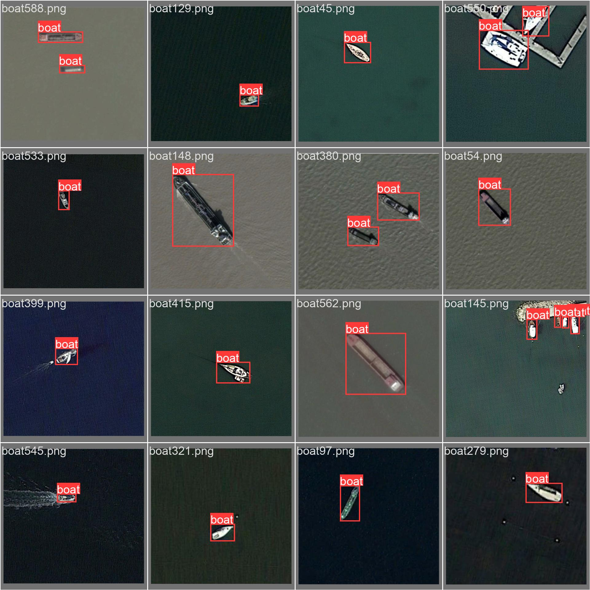
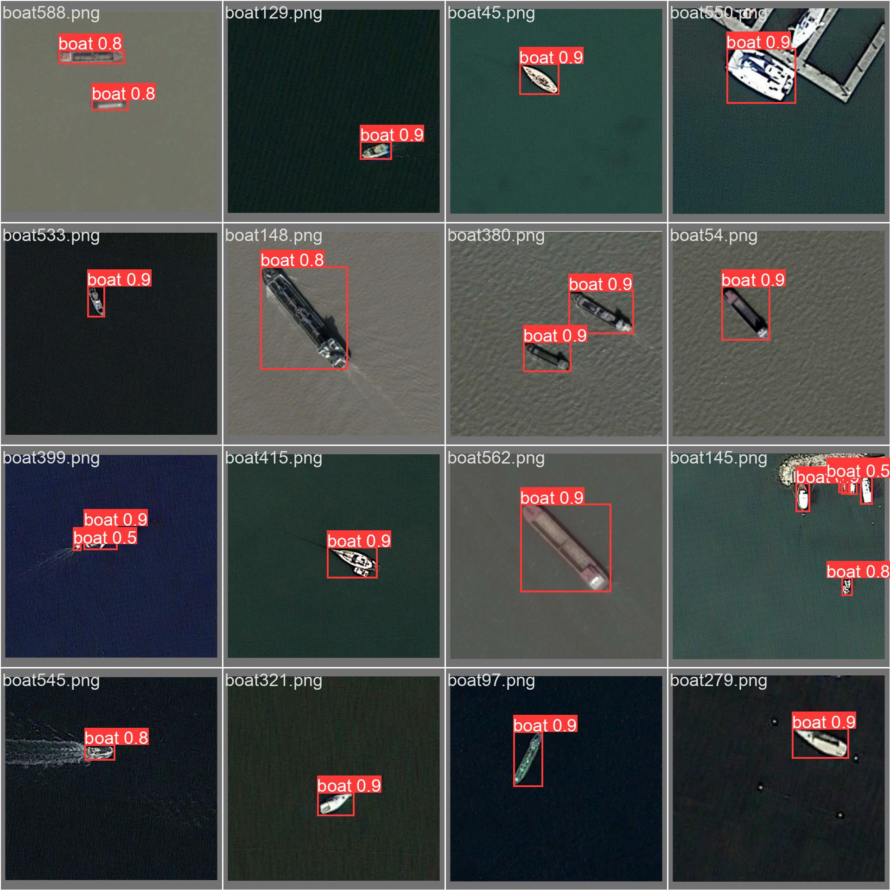

# Boat Detector Model Performance Report

## Overview

This report summarizes the performance of the trained AI model designed to detect boats. The analysis includes key performance metrics, visualizations of the model's behavior, and insights derived from the results.

---

## Key Metrics

### Precision-Recall Curve

The Precision-Recall (PR) curve illustrates the trade-off between precision and recall for different threshold settings.

- **Mean Average Precision (mAP@0.5)**: 0.725
- **Class-specific mAP (Boat)**: 0.725

This indicates a strong performance, as values closer to 1 reflect better precision and recall balance.

---

### Confusion Matrix

The confusion matrix provides insight into the model's classification performance, highlighting true positives, false positives, true negatives, and false negatives.

---

## Results Summary (from `results.csv`)

Key metrics extracted from the training and validation results include:

| Metric              | Value  |
|---------------------|--------|
| **Box Loss**         | X.XXX  |
| **Objectness Loss**  | X.XXX  |
| **Classification Loss** | X.XXX |
| **Precision**        | X.XXX  |
| **Recall**           | X.XXX  |

The results indicate that the model performs well in terms of localization and classification, with balanced precision and recall.

---

## Visual Analysis

### Label Distribution

The label distribution provides insights into the dataset's composition and the spatial distribution of detected boats.

---

### Training and Validation Samples

Visual samples from training and validation batches showcase the model's detection capabilities and any potential misclassifications.

**Training Samples:**

**Validation Samples:**

**Labels:**

**Predictions:**

---

## Conclusion

The model demonstrates strong performance with a mean average precision of 0.725. The visualizations and metrics suggest effective detection of boats with balanced precision and recall. Further fine-tuning of hyperparameters and additional training data could enhance performance even more.

---

## Configuration Files

- **opt.yaml** - Model options and settings
- **hyp.yaml** - Hyperparameter configurations

---

## Generated Files

- **results.png** - Summary visualization of the training process
- **weights/** - Directory containing the trained model weights

---
