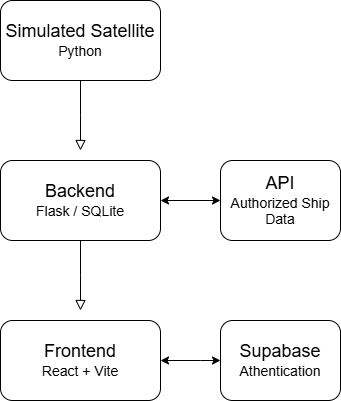

# ShipSight - Satellite Shipping Detection

## Table of Contents
- [Overview](#overview)
- [Prerequisites](#prerequisites)
- [Quick Start](#quickstart)
- [Installation](#installation)
- [Architecture](#architecture)
- [User Guide](#userguide)
- [Developer Guide](#developerguide)
- [Roadmap](#roadmap)
- [Contact](#contact)


# Overview<a id="overview"></a>

**ShipSight - Sattelite Ship Detection** is a secure, end‑to‑end web platform that turns raw satellite imagery into actionable maritime intelligence in near‑real‑time.

1. **Acquire** – A partner Earth‑observation satellite captures high‑resolution images of a defined ocean sector (currently the San Francisco Bay and approaches). Currently the satellite is simulated from the backend of our web tool.
2. **Detect & Classify** – An onboard AI model performs image edge‑based object detection, flags ship images, and assigns a vessel classification (cargo, tanker, fishing, etc.).  
3. **Verify** – The backend ingests the detections, queries an authoritative registry API, and tags each vessel as **authorized** or **unauthorized** for the zone.  
4. **Visualize** – The frontend renders vessels on an interactive map with type‑specific icons; unauthorized targets are highlighted in red. A companion “Ship” page shows richer metadata.  
5. **Secure** – Role‑based authentication gates both the map and list views. Currently, everything is available to anyone with an account as there is no propriatary or secure data available on the page.

#### Why it matters
- **Situational awareness** – Coastal authorities and port operators see unregistered or restricted vessels instantly.  
- **Automation first** – AI inference on the satellite minimizes downlink bandwidth and latency.  
- **Single pane of glass** – Map and tabular views unite geospatial and registry data in one UI.


# Prerequisites<a id="prerequisites"></a>

| Component / Tool | Minimum Version | Why it’s needed |
|------------------|-----------------|-----------------|
| **Operating System** | Linux (kernel ≥ 5.4), macOS 13+, or Windows 11 | Verified test environments |
| **Node.js** | 20 LTS | Runs `npm install` for the frontend build |
| **Poetry** | 1.8+ | Installs backend dependencies and locks them; not required at runtime |
| **Python** | 3.11+ | Backend service runtime |
| **SQLite** | 3.40+ | Primary datastore for the backend |
| **Supabase CLI** | 1.0⁺ | Stores the authentication | 
| **Modern Browser** | Chrome, Edge, or Firefox (latest) | Full WebGL & ES2020 support for the map UI |
| **CPU / RAM** | 4 vCPU, 8 GB RAM | Smooth local development and AI‑model warm‑up |


# Quick Start<a id="quickstart"></a>

#### 1. End‑user access  
1. Open **129.123.153.8:8080** in any modern browser connected to USU wifi.
2. Click **Sign Up**, create an account, and verify your email.  
3. Head to the **User Guide** for tips on navigating the map and vessel list.

---

#### 2. Local development
See Installation for a more in-depth Guide to get ShipSight Running

```bash
# Clone the repo (or download the source)
git clone https://github.com/JarronConover/Satellite-Detection
cd Satellite-Detection

cd Frontend/
cp .env.example .env    # edit the .env file with proper API keys and passwords
cd ../Backend/
cp .env.example .env

docker compose up --build -d
```

# Installation<a id="installation"></a>

The **Quick Start** section shows the _fastest_ way to see ShipSight running.  
**Installation** goes deeper—laying out exact steps and options for a clean, repeatable setup on your own machine or server.

> **Tip:** If you just want to _try_ ShipSight, skip to **Quick Start**.  
> Follow **Installation** when you care about virtual envs, dependency locking, and persistent data.

---

### 1. Clone the repository

```bash
git clone https://github.com/your-org/shipsight.git
cd shipsight
```
### Running Locally
### 2. Backend Setup Locally

Run the following commands:

``` bash
python3 -m venv venv
source venv/bin/activate
pip install -r requirements.txt
flask --app flaskr init-db

export FLASK_APP="flaskr:create_app"
export FLASK_ENV=development
flask run --host=0.0.0.0 --port=8000
```

### 3. Frontend Setup Locally

1. Install Dependencies 
```
cd ../frontend
npm install                         # installs React/Vite dependencies
```

### 4. Running main (the Satellite)
As we do not have a functioning satellite, this is how you call the AI Model that is using static images for ship detection.

Run these commands:

``` bash
cd /main/py_sat/

python3 -m venv venv
source venv/bin/activate
pip install -r requirements.txt

python3 mainpy
```

### 5. Running the Stack
After installing both frontend and backend dependencies, you can run each service locally in separate terminals.

**Backend**
```bash
cd backend
python App.py
```

**Frontend**
```bash
cd frontend
npm run dev
```

### Running with Docker
### 2. Set up the database
Run the following commands:
``` bash
docker compose up --build -d
```
### 3. Running main (the Satellite)
See step 4 of prior instructions


# Architecture<a id="architecture"></a>

ShipSight is composed of four main components: a simulated satellite data source, a backend service, an authentication layer, and a React-based frontend. Together, they deliver a real-time ship detection and monitoring system.

---

### System Components

| Component       | Technology      | Description |
|-----------------|------------------|-------------|
| **Simulated Satellite** | Python program (CLI or scheduled job) | Emulates satellite image detection and classification. Sends ship data to the backend via HTTP. |
| **Backend**     | Flask (Python)   | Handles API requests, processes satellite data, checks ship authorization, and exposes endpoints to the frontend. |
| **Database**    | SQLite           | Stores ship detections, classifications, and lookup results. Lightweight and portable. |
| **Authentication** | Supabase Auth | Manages user login, registration, and session tokens via Supabase’s hosted auth service. |
| **Frontend**    | React + Vite     | Interactive web interface showing a live vessel map, a ship list, and user account management features. |

---

### Data Flow

1. **Satellite (Simulated)** sends vessel detection data to the backend via HTTP POST.
2. **Backend** stores this data in the SQLite database and queries an external API to validate if the ship is authorized in the zone.
3. **Backend** exposes API endpoints for the frontend to pull live ship data and statuses.
4. **Frontend** queries these endpoints and renders vessels on a map with icons based on ship type.
5. **Supabase Auth** handles user authentication and session validation for protected frontend routes.

---

### Hosting & Deployment

- All components can be run locally during development.
- The system is modular and supports deployment via Docker or cloud services.

### Architecture Diagram




# User Guide<a id="userguide"></a>

### 1. Getting Started
- URL: 129.123.153.8:8080 (On USU wifi and if the Server: Arceus is running the service)
- Supported browsers: Chrome, Firefox, Edge, Safari
- Click "Don't have an account? Sign up" and input a valid email adress and create a password and click "Sign up"
- See the "Account Page" section for more details on how to work with your account.
- Navigate through the website as described below.
- To sign out click the blue "Sign Out" button on the right corner of the navigation bar.

---

### 2. Navigating the Interface

### Home Page

- The Home Page:
    - Contains a navbar and 3 horizontal panels.
- The Navbar
    - The "Sign Out" button in the top right corner that signs the logged in user out
    - A title of the current page
    - The "Menu Tab" which slides in the Menu Sidebar
- Menu Sidebar
    - Home button that directs you to the Home page
    - Map button that directs you to the Map page
    - Ship button that directs you to the Ships page
    - Account button that directs you to the Account page
    - Click the menu tab to open or close the Menu Sidebar
- Horizontal Panels
    - Click the Panel to be directed to the page described on it.

#### Map Page

- The Map Page:
    - Contains a navbar and the Map component
- The Map
    - Click and drag to navigate the map
    - Ships are displayed from the API
    - Click on a ship to display a pop up of information
    - Double Click on a ship to go to that ships "Ship Details" page
    - A ship that is displayed in red is Unauthorized.
    - Bottom Left corner contains a grab tool to naviage the map
    - Bottom left corner contains a select tool to go to the page of the selected ship(s)
    - Bottom right corner contains a full screen button that displays the map full screen, press the escape key to exit full screen
    - Bottom right corner contains a navigation buttons that displays navigation buttons to navigate throughout the map

#### Ships Page

- The Ships Page:
    - Contains a navbar, "Filter Ships" button, and Ship Detail Cards
- Filter Ships
    - When the button is clicked a set of filters is displayed to select from
    - The filters that are selected will be displayed
- Ship Detail Cards
    - Click the Ship Detail Card to navigate to the specific Ship Detail Page for that ship
    - Unauthorized Ships are brought to the top of the cards
    - Color Scheming of classifications: Red: Unauthorized; Blue: Fishing; Green: Warship; Purple: Cargo

#### Ship Details Page

- The Ship Details Page
    - Contains a navbar, "Ship Details" Card
- Ship Details Card
    - The card contains details about the specific ship and a "Show on Map" button
    - The "Show on Map" button directs you to the Map Page

#### Account Page

- The Account Page:
    - Contains a navbar, and "Account Settings" card
- Account Settings Card
    - Displays current email
    - A place where you can update your email
    - A place to change your password and confirm it.


# Developer Guide<a id="developerguide"></a>

### 1. Project Structure
- backend
- frontend
- AIWaterfall
- main
- old-frontend
- Global Files

#### backend

- contains all files relating to the backend

#### frontend

- contains all files relating to the frontend and authentication of supabase 

#### AIWaterfall

- contains all files relating to training the AI Model

#### main

- This functions as our "Satellite" which means it runs the AI Model that detects the ships and sends out a JSON of data to the backend.

#### old-frontend

- this contains our old frontend code and is only kept in the project as a reference to past work done on the assignment

#### Global Files

- .env
    - Create a .env file with the example given with the .env.example
    - There is a .env file for frontend and backend that should be identical.
- .env.example
    -  ``` 
        VITE_REACT_APP_GOOGLE_MAPS_API_KEY=key
        AISSTREAM_API_KEY=key
        SUPABASE_PASSWWORD=pass
        ```
- README.md
    The documentation of the Project
- Software Requirements
    - The initial requirements of the project
- docker-compose.yaml
  - a classic docker file to get docker running


### 9. Github

- Pull requests should follow this pathing:
    - Main <-- Dev <-- Feature <-- Branches

### 10. Resources
- This 'README.md'
- Software Requirements.md
- Github Repo: https://github.com/JarronConover/Satellite-Detection
- AISHub documentation for API: https://www.aishub.net/api


# Roadmap<a id="roadmap"></a>

The long-term vision for ShipSight goes beyond simulated environments. Our goal is to evolve this platform into a global maritime intelligence tool powered by real satellite data and secure, scalable infrastructure.

---

### Near-Term Goals (0–6 months)

- **Deploy to real satellite hardware**  
  Transition from a server-based simulation to actual satellite integration, enabling live imagery and classification from orbit.

- **Harden authentication and access controls**  
  Ensure that only verified users with approved credentials can access protected data or functionality.

- **Improve refresh rate and latency**  
  Optimize backend data flow and image ingestion pipelines to reduce the delay between capture, classification, and display.

---

### Mid-Term Goals (6–12 months)

- **Global zone coverage**  
  Expand supported ocean regions beyond San Francisco Bay, integrating with international ship registries and APIs.

- **Robust alerting and notification system**  
  Notify users in real-time when unauthorized vessels appear in monitored zones.

- **User roles and permissions**  
  Introduce multi-tiered access (e.g., admin, analyst, viewer) for government and commercial operators.

---

### Long-Term Vision (1+ years)

- **Deploy to other domains**  
  Use this satellite + AI + real-time geospatial pipeline in fields such as:
  - **Wildfire detection** via thermal imaging
  - **Deforestation tracking** using vegetation change analysis
  - **Disaster response** by flagging impacted zones from orbital imagery
  - **Agricultural health monitoring** through NDVI and edge detection

- **ML model self-adaptation**  
  Implement continuous learning and feedback from confirmed vessel identifications to improve classification accuracy over time.

- **Enterprise and API productization**  
  Offer ShipSight as a commercial SaaS platform with pluggable APIs and exportable data feeds.

---

We're building toward a future where real-time spaceborne detection becomes a flexible intelligence layer across industries.


# Contacts

- Jarron Conover: jarron.conover@gmail.com 
- Thomas Le Sueur: a02406824@usu.edu
- Jaden Anderson: 435-770-6846 Jadenanderson22@gmail.com
- Braden Cannon: 260-338-4407 bradenxcannon@gmail.com
